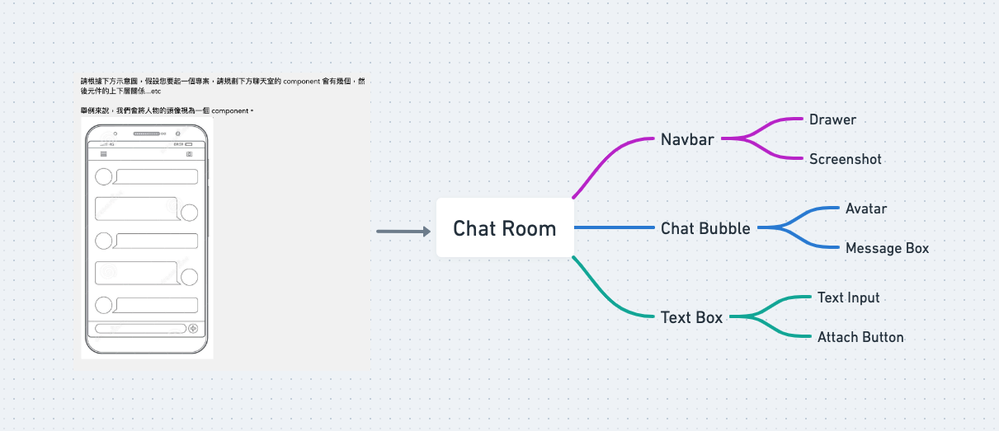

# Q1

```js
function caclulate(n) {
  if (n % 2 === 0) {
    return 1 + ((n - 2) / 2) * -1 + n;
  } else {
    return (3 - n) / 2;
  }
}

const calc = caclulate(10);

console.log(calc);
```

# Q2
```js
function lotteryDraw() {
  const prizes = [
    { id: 1, name: "頭獎", count: 1, probability: 0.001 },
    { id: 2, name: "貳獎", count: 1, probability: 0.03 },
    { id: 3, name: "參獎", count: 3, probability: 0.13 },
    { id: 4, name: "肆獎", count: 5, probability: 0.18 },
    { id: 5, name: "伍獎", count: 9, probability: 0.25 },
  ];

  let remainingPrizes = prizes.slice(); // 創建獎池的副本

  return function drawPrize() {
    if (remainingPrizes.length === 0) {
      console.log("獎池內沒有獎品了！");
      return null;
    }

    let totalProbability = remainingPrizes.reduce((total, prize) => total + prize.probability, 0);
    let randomNumber = Math.random() * totalProbability;

    let accumulatedProbability = 0;
    let selectedPrizeIndex = remainingPrizes.findIndex((prize) => {
      accumulatedProbability += prize.probability;
      return randomNumber < accumulatedProbability;
    });

    let selectedPrize = remainingPrizes[selectedPrizeIndex];
    if (selectedPrize) {
      console.log(`抽到 ${selectedPrize.name}`);
      selectedPrize.count--;

      if (selectedPrize.count === 0) {
        remainingPrizes.splice(selectedPrizeIndex, 1); // 從獎池中移除已經抽完的獎品
      }

      let remainingPrize = remainingPrizes.map((prize) => `${prize.name}: ${prize.count}`);
      console.log(`獎池內剩餘獎品： ${remainingPrize.join(", ")}`);

      return selectedPrize;
    }
  };
}

const drawPrize = lotteryDraw();

// 進行抽獎，直到獎池內沒有獎品為止
while (drawPrize()) {}
```
# Q3



# Q4

[Demo](https://pakerzhang-ubike.zeabur.app/)   
[ubike](https://github.com/pakerchang/bat-mobile/tree/master/ubike)
